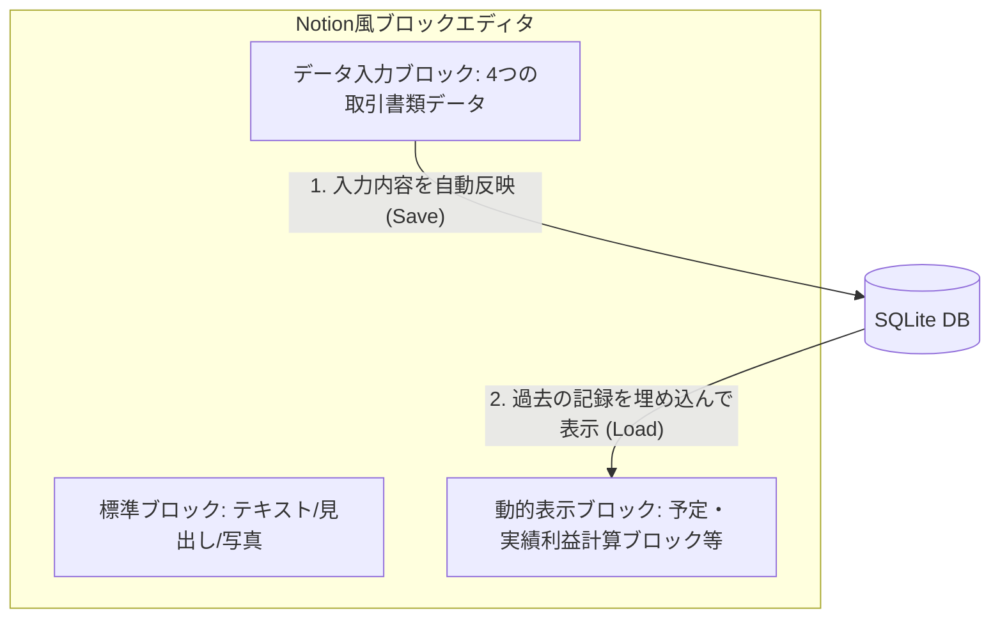

# w-cms ソフトウェアコンセプト・設計仕様書

このドキュメントでは、**w-cms** の基本コンセプトである「リッチコンテンツエディタとデータベースの双方向連携」および、具体的なユースケース（価格・コスト・粗利管理、製造ログ、写真付きマニュアル等）の仕様について定義します。

---

## 1. コア・コンセプト：Notion風ブロックエディタとDBの双方向連携

w-cms は、単なるテキスト記述システムではなく、**「Notionのようなブロックエディタ（リッチコンテンツエディタ）で作成したブロック情報が自動でデータベースに反映され、逆にデータベースのデータが特定のブロック内に動的に反映される」**という、ブロックを起点とした双方向連携システムです。

### ① ブロックへの書き込みがデータベースへ反映される（インプット）
Notionのようにブロックを組み合わせてドキュメントを記述します。
その中で、実業務でやり取りされる**「4つの取引書類」**に対応するデータブロックに入力された情報が、自動的に解析されてSQLiteデータベースへ即座に登録（反映）されます。

### ② 各ページ（ブロック）にデータベースのデータが反映される（アウトプット）
ページを表示する際、**「原価・利益算出ブロック」**などの動的ブロックが、データベースから最新の情報を自動的に引き出し、ページ内にリアルタイムで反映（レンダリング）します。

---

## 2. 従業員に分かりやすい「4つの取引書類」の整理とユースケース

業務フローに合わせて、システム上で扱うドキュメントを従業員の方々が普段使っている言葉で以下のように整理します。

### 2.1. 扱う4つの取引書類

1.  **弊社の見積もり**（弊社 ➡ 顧客）
    *   *意味*: 弊社がお客様に提示した販売予定価格。
2.  **顧客の発注書**（顧客 ➡ 弊社）
    *   *意味*: お客様から正式に頂いた、確定した受注価格（売上の実績値）。
3.  **材料屋・加工業者の見積もり**（材料屋・加工業者 ➡ 弊社）
    *   *意味*: 部材の仕入や外注加工費の予定原価。
4.  **弊社の発注書**（弊社 ➡ 材料屋・加工業者）
    *   *意味*: 弊社が仕入先や外注先に正式に発注した、確定した仕入・外注原価（コストの実績値）。

---

### 2.2. これにより実現できる「2つの利益管理」ユースケース

製品ページ等に `「原価・利益算出ブロック」` を配置することで、この4つのデータを突き合わせ、自動で利益のシミュレーションと振り返りを行います。

#### A. 見積（予定）段階の利益シミュレーション
まだ発注が確定していない段階で、十分な利幅があるかをチェックします。
*   **計算式**: `「弊社の見積もり」の単価` － `「材料屋・加工業者の見積もり」の合計単価` ＝ **予定粗利益**

#### B. 発注・受注（実績）段階の利益振り返り
実際の取引が完了した際に、当初の計画通りに利益が出たかを検証します。
*   **計算式**: `「顧客の発注書」の単価` － `「弊社の発注書」の合計金額` ＝ **実績粗利益**

---

## 3. 実装に向けたデータモデル設計（案）

ドキュメント本体はファイルとして保存されるため、データベースは「4つの取引書類」から抽出した数値データを格納し、集計する構造になります。

### ① `pages` テーブル（ドキュメントのインデックス）
*   `id` (TEXT, PRIMARY KEY): ページID (例: `"260603-103"`)
*   `title` (TEXT): ページタイトル
*   `file_path` (TEXT): 物理ファイル（`document.json`）の保存先パス
*   `updated_at` (DATETIME): 更新日時

### ② `page_tags` テーブル（可変属性インデックス）
*   `page_id` (TEXT, FOREIGN KEY): `pages.id` に紐づく
*   `name` (TEXT): 属性の名前（キー） (例: `"支払条件"`, `"担当者"`, `"納入先"`)
*   `value` (TEXT): 属性の値 (例: `"通常"`, `"紀平"`, `"松阪工場"`)

### ③ `our_estimates` テーブル（「弊社の見積もり」インデックス）【新規】
*   `id` (INTEGER, PRIMARY KEY AUTOINCREMENT)
*   `item_id` (TEXT): 製品ID（図面番号など）
*   `client_name` (TEXT): 見積提示先の顧客名
*   `price` (INTEGER): 提示した見積単価
*   `source_page_id` (TEXT, FOREIGN KEY): 抽出元の「弊社の見積もり」ページID
*   `estimated_at` (DATE): 見積提示日

### ④ `client_orders` テーブル（「顧客の発注書」インデックス）
*   `id` (INTEGER, PRIMARY KEY AUTOINCREMENT)
*   `item_id` (TEXT): 製品ID
*   `client_name` (TEXT): 発注元顧客名
*   `price` (INTEGER): 受注単価（売上）
*   `quantity` (INTEGER): 数量
*   `source_page_id` (TEXT, FOREIGN KEY): 抽出元の「顧客の発注書」ページID
*   `ordered_at` (DATE): 受注日

### ⑤ `supplier_estimates` テーブル（「材料屋・加工業者の見積もり」インデックス）【新規】
*   `id` (INTEGER, PRIMARY KEY AUTOINCREMENT)
*   `item_name` (TEXT): 材料名、または外注加工内容
*   `supplier_name` (TEXT): 材料屋、または加工業者の名前
*   `cost` (INTEGER): 提示された見積単価（予定原価）
*   `source_page_id` (TEXT, FOREIGN KEY): 抽出元の「材料屋・加工業者の見積もり」ページID
*   `estimated_at` (DATE): 見積日

### ⑥ `our_orders` テーブル（「弊社の発注書」インデックス）【新規】
*   `id` (INTEGER, PRIMARY KEY AUTOINCREMENT)
*   `item_name` (TEXT): 購入した材料名、または発注した加工内容
*   `supplier_name` (TEXT): 発注先の材料屋、または加工業者の名前
*   `cost` (INTEGER): 確定した発注単価（実績原価）
*   `quantity` (INTEGER): 数量
*   `source_page_id` (TEXT, FOREIGN KEY): 抽出元の「弊社の発注書」ページID
*   `ordered_at` (DATE): 発注日

---

## 4. 今後の開発ロードマップ

1.  **エディタの保存・ロード機構の設計**:
    *   ブロックデータを `document.json` としてファイルシステムに書き込み、再読み込みするフロント・バックエンド連携の実装。
2.  **データベース（sqlite.go）のインデックス化**:
    *   「4つの取引書類」に対応する上記のテーブル群をデータベースの初期化処理に追加。
3.  **可変タグ同期ロジック（sync.go）の実装**:
    *   保存時に、記述された情報を4つのテーブルにそれぞれマッピングして同期するロジックの実装。
4.  **動的反映・計算ブロックの実装**:
    *   製品ページにおいて、「予定利益（弊社の見積もり － 材料屋・加工業者の見積もり）」および「実績利益（顧客の発注書 － 弊社の発注書）」を自動集計・対比して表示する計算ブロックの実装。
