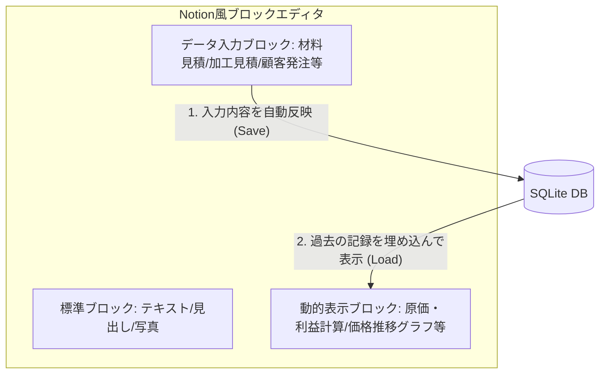

# w-cms ソフトウェアコンセプト・設計仕様書

このドキュメントでは、**w-cms** の基本コンセプトである「リッチコンテンツエディタとデータベースの双方向連携」および、具体的なユースケース（仕入れ・外注原価管理、顧客発注・見積、製造ログ、写真付きマニュアル等）の仕様について定義します。

---

## 1. コア・コンセプト：Notion風ブロックエディタとDBの双方向連携

w-cms は、単なるテキスト記述システムではなく、**「Notionのようなブロックエディタ（リッチコンテンツエディタ）で作成したブロック情報が自動でデータベースに反映され、逆にデータベースのデータが特定のブロック内に動的に反映される」**という、ブロックを起点とした双方向連携システムです。

### ① ブロックへの書き込みがデータベースへ反映される（インプット）
Notionのようにブロックを組み合わせてドキュメントを記述します。
その中で、**「顧客発注ブロック」「材料見積ブロック」「外注加工見積ブロック」**などのデータブロックに入力された情報が、自動的に解析されてSQLiteデータベースへ即座に登録（反映）されます。
*   **対象文書の例**: 顧客からの発注書、材料屋からの見積書、加工業者からの見積書、自社の日報など。

### ② 各ページ（ブロック）にデータベースのデータが反映される（アウトプット）
ページを表示する際、**「原価・利益算出ブロック」**や**「価格・コスト推移グラフブロック」**といった動的ブロックが、データベースから最新の情報を自動的に引き出し、ページ内にリアルタイムで反映（レンダリング）します。
*   取引先や仕入先ごとの個別の見積書・発注書から蓄積されたデータベース情報が、製品詳細ページ内の特定ブロックへ自動的に集計・反映されます。

---

## 2. 具体的なユースケースとブロック構成

### 2.1. 材料コスト・外注加工費の推移管理（各種見積書から）
材料屋や加工業者から取得した見積書をWiki（ブロックエディタ）に書き留めることで、仕入原価や外注費の推移をトラッキングします。
*   **入力ページ（材料見積書・加工見積書）**:
    *   `「材料見積ブロック」` や `「加工見積ブロック」` を使用して、材料名/加工内容、単価、仕入先・加工業者名、見積日を入力・保存。
    *   データは `material_costs` や `processing_costs` テーブルに自動反映されます。
*   **出力ページ（材料・加工詳細）**:
    *   `「コスト推移表示ブロック」` が、過去の仕入価格の変動をグラフや表で表示します。

### 2.2. 顧客発注と原価・利益の動的算出（顧客発注書・各種見積書から）
お客様から頂いた発注書の情報と、材料屋・加工業者からの見積書データを組み合わせ、製品ごとの正確な原価と粗利益を自動算出します。
*   **入力ページ（顧客発注書）**:
    *   `「顧客発注ブロック」` を使用して、製品名、受注数量、販売単価、納期、顧客名を入力・保存（`client_orders` に反映）。
*   **出力ページ（製品詳細・見積作成画面）**:
    *   `「原価・利益算出ブロック」` を配置。
    *   このブロックがDBから「最新の材料見積単価」＋「最新の外注加工見積単価」（および自社加工費）を自動取得し、顧客発注額（売上）と比較して、**「最新の原価構成」「粗利益」「利益率」**をリアルタイムに計算して反映します。

### 2.3. 製造プロセスの記録と見積もり（作業日報から）
自社工場での「設備・加工内容・所要時間」を記録し、見積もり時の人件費・設備費算出に役立てます。
*   **入力ページ（作業日報など）**:
    *   `「製造記録ブロック」` を使用して、使用機械、加工方法、所要時間（分）を入力・保存（`manufacturing_logs` に反映）。
*   **出力ページ（製品詳細など）**:
    *   過去の製造ログDBから「平均加工時間」を集計し、社内の機械レート・人件費を乗算した自社加工費の見積もりを自動算出。

### 2.4. 写真付き製造マニュアルとしての活用
製造現場での工程ごとの作業内容やコツを、写真付きの「製造マニュアル」として共有します。
*   **入力ページ（マニュアル作成画面）**:
    *   `「工程画像ブロック」` と `「工程説明ブロック」` を使用して、画像と説明文を記述。
*   **出力ページ（マニュアル表示画面）**:
    *   `「ステップマニュアルブロック」` がDBから画像と説明を工程順にロードして表示。

---

## 3. 実装に向けたデータモデル設計（案）

ブロックエディタ構造とサプライチェーンのコスト管理をサポートするためのデータベーステーブル構造案です。

### ① `pages` テーブル（ページ・ドキュメント管理）
*   `id` (TEXT, PRIMARY KEY): ページID
*   `title` (TEXT): ページタイトル
*   `blocks_json` (TEXT): ページ内の全ブロック構成を保持するJSONデータ

### ② `client_orders` テーブル（顧客発注履歴データ）【新規】
*   `id` (INTEGER, PRIMARY KEY AUTOINCREMENT)
*   `item_id` (TEXT): 製品ID
*   `client_name` (TEXT): 取引先顧客名
*   `price` (INTEGER): 受注単価（売上）
*   `quantity` (INTEGER): 数量
*   `source_page_id` (TEXT, FOREIGN KEY): 抽出元（顧客発注書）のページID
*   `ordered_at` (DATE): 受注日

### ③ `material_costs` テーブル（材料仕入見積データ）【新規】
*   `id` (INTEGER, PRIMARY KEY AUTOINCREMENT)
*   `material_name` (TEXT): 材料・部材名
*   `supplier_name` (TEXT): 材料屋名
*   `cost` (INTEGER): 材料単価（原価）
*   `source_page_id` (TEXT, FOREIGN KEY): 抽出元（材料見積書）のページID
*   `estimated_at` (DATE): 見積日

### ④ `processing_costs` テーブル（外注加工見積データ）【新規】
*   `id` (INTEGER, PRIMARY KEY AUTOINCREMENT)
*   `item_id` (TEXT): 対象製品ID
*   `contractor_name` (TEXT): 加工業者名
*   `process_method` (TEXT): 加工内容
*   `cost` (INTEGER): 外注加工単価（原価）
*   `source_page_id` (TEXT, FOREIGN KEY): 抽出元（加工見積書）のページID
*   `estimated_at` (DATE): 見積日

### ⑤ `manufacturing_logs` テーブル（自社製造プロセスデータ）
*   `id` (INTEGER, PRIMARY KEY AUTOINCREMENT)
*   `item_id` (TEXT): 対象製品ID
*   `machine_name` (TEXT): 使用機械
*   `process_method` (TEXT): 加工方法
*   `duration_minutes` (INTEGER): 加工時間
*   `source_page_id` (TEXT, FOREIGN KEY): 抽出元日報のページID
*   `recorded_at` (DATE): 作業日

---

## 4. 今後の開発ロードマップ

1.  **ブロックデータのシリアライズ設計**:
    *   Notion風エディタから出力されるブロックデータ（JSON形式）を Go 側でパースし、見積（材料・加工）、発注（顧客）、日報ログ等の各DBテーブルへデータを振り分けて保存する機構の設計。
2.  **データベース（sqlite.go）へのブロック・原価対応**:
    *   `client_orders`、`material_costs`、`processing_costs`、`manufacturing_logs` などのテーブルを初期化処理に追加。
3.  **ブロック対応同期ロジック（sync.go）の拡張**:
    *   各種見積書・発注書のブロック情報から、原価・売上データを正確に抽出しDBに同期するロジックを実装。
4.  **動的反映・計算ブロックの実装**:
    *   製品詳細ページなどで、「最新材料費（DB）」＋「最新外注費（DB）」＋「自社加工費（日報DB集計）」を自動で合計して原価を算出し、顧客発注額（売上）と比較して粗利益を算出・表示する計算ブロックの実装。
