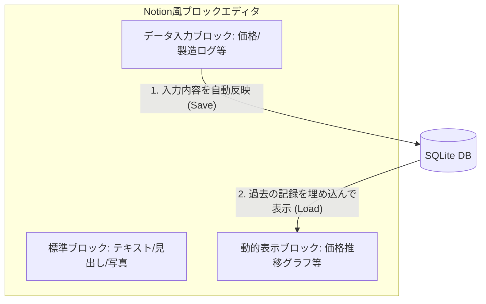

# w-cms ソフトウェアコンセプト・設計仕様書

このドキュメントでは、**w-cms** の基本コンセプトである「リッチコンテンツエディタとデータベースの双方向連携」および、具体的なユースケース（部材価格の推移、製造プロセスの記録、写真付きマニュアル等）の仕様について定義します。

---

## 1. コア・コンセプト：Notion風ブロックエディタとDBの双方向連携

w-cms は、単なるテキスト記述システムではなく、**「Notionのようなブロックエディタ（リッチコンテンツエディタ）で作成したブロック情報が自動でデータベースに反映され、逆にデータベースのデータが特定のブロック内に動的に反映される」**という、ブロックを起点とした双方向連携システムです。

### ① ブロックへの書き込みがデータベースへ反映される（インプット）
Notionのように、ユーザーがブロック（見出し、段落、リスト、画像など）を組み合わせてドキュメントを記述します。
その中で、**「価格入力ブロック」**や**「製造記録ブロック」**といった特殊なデータブロックに入力された情報が、自動的に解析されてSQLiteデータベースへ即座に登録（反映）されます。
*   ドキュメント作成の自然な流れの中で、構造化データが自動的に蓄積されていきます。

### ② 各ページ（ブロック）にデータベースのデータが反映される（アウトプット）
ページを表示する際、**「価格推移グラフブロック」**や**「製造履歴リストブロック」**といった動的ブロックが、データベースから最新の情報を自動的に引き出し、ページ内にリアルタイムで反映（レンダリング）します。
*   別のドキュメント（納品書や作業日報など）で更新された最新のデータベース情報が、該当製品の紹介ページ内の特定ブロックへ自動的に反映されます。

---

## 2. 具体的なユースケースとブロック構成

### 2.1. 部材の価格推移管理
仕入れた部材の価格推移を自動でトラッキングし、仕入れ価格の変動を可視化します。
*   **入力ページ（納品書など）**:
    *   `「価格入力ブロック」` を使用して、部材名、価格、取引日を入力。
    *   保存時にそのデータがDBの `price_history` に自動反映されます。
*   **出力ページ（部材詳細など）**:
    *   `「価格推移表示ブロック」` を配置。
    *   このブロックがDBから対象部材の過去の価格履歴をロードし、グラフや表としてページ内に反映します。

### 2.2. 製造プロセスの記録と見積もり算出への活用
製造時の「設備・加工内容・所要時間」を記録し、将来の製品見積もり（コスト計算）の精度向上や自動化に役立てます。
*   **入力ページ（作業日報など）**:
    *   `「製造記録ブロック」` を使用して、使用機械、加工方法、所要時間（分）を入力・保存し、DBに自動反映します。
*   **出力ページ（製品詳細など）**:
    *   `「見積り算出・履歴ブロック」` を配置。
    *   過去の全作業日報DBから集計された「平均加工時間」や「自動計算された見積もり参考価格」がブロック内に動的に反映されます。

### 2.3. 写真付き製造マニュアルとしての活用
製造現場での工程ごとの作業内容やコツを、写真付きの「製造マニュアル」としてWeb上で一元管理・共有します。
*   **入力ページ（マニュアル作成画面）**:
    *   `「工程画像ブロック」`（ドラッグ＆ドロップで写真を挿入）と `「工程説明ブロック」` を組み合わせて作成。
    *   画像のパスと説明文がDBにインデックス登録されます。
*   **出力ページ（マニュアル表示画面）**:
    *   `「ステップマニュアルブロック」` がDBから画像とテキストを工程順（ステップ順）に取得し、スマホやタブレットで見やすいレスポンシブなマニュアルとして表示・反映します。

---

## 3. 実装に向けたデータモデル設計（案）

ブロックエディタ構造とユースケースをサポートするためのデータベーステーブル構造案です。

### ① `pages` テーブル（ページ・ドキュメント管理）
*   `id` (TEXT, PRIMARY KEY): ページID
*   `title` (TEXT): ページタイトル
*   `blocks_json` (TEXT): ページ内の全ブロック構成を保持するJSONデータ（Notion形式のブロックツリー）
*   `updated_at` (DATETIME): 更新日時

### ② `price_history` テーブル（価格履歴データ）
*   `id` (INTEGER, PRIMARY KEY AUTOINCREMENT)
*   `item_id` (TEXT): 部材ID
*   `price` (INTEGER): 単価
*   `source_page_id` (TEXT, FOREIGN KEY): 抽出元（納品書等）のページID
*   `recorded_at` (DATE): 記録日

### ③ `manufacturing_logs` テーブル（製造プロセスデータ）
*   `id` (INTEGER, PRIMARY KEY AUTOINCREMENT)
*   `item_id` (TEXT): 対象製品ID
*   `machine_name` (TEXT): 機械名
*   `process_method` (TEXT): 加工方法
*   `duration_minutes` (INTEGER): 時間（分）
*   `source_page_id` (TEXT, FOREIGN KEY): 抽出元（日報等）のページID
*   `recorded_at` (DATE): 作業日

### ④ `process_photos` テーブル（マニュアル用画像データ）
*   `id` (INTEGER, PRIMARY KEY AUTOINCREMENT)
*   `item_id` (TEXT): 製品ID
*   `step_number` (INTEGER): 工程順
*   `image_path` (TEXT): 画像ファイルパス
*   `description` (TEXT): 説明
*   `source_page_id` (TEXT, FOREIGN KEY): 抽出元（マニュアル等）のページID

---

## 4. 今後の開発ロードマップ

1.  **ブロックデータのシリアライズ設計**:
    *   Notion風エディタから出力されるブロックデータ（JSON形式など）を Go 側でパースし、各データベーステーブルへデータを振り分けて保存する機構の設計。
2.  **データベース（sqlite.go）へのブロック対応**:
    *   `pages` テーブルを `blocks_json` を格納できるように拡張し、各種データテーブルと紐付け。
3.  **ブロック対応パーサー/同期ロジック（parser.go / sync.go）の拡張**:
    *   JSONブロックデータから「価格」「日報」「画像」などの特定ブロックを検出し、DBと同期するロジックの実装。
4.  **フロントエンド（エディタ）の実装**:
    *   JavaScript（Editor.js などの既存ライブラリやカスタム実装）を用いて、Notion風にブロックを追加・編集できるエディタUIの構築。
5.  **動的ブロック反映機能の実装**:
    *   ページ読み込み時に、特定の動的ブロック（グラフや履歴リスト）が自動でDBからデータを取得して描画する機構の実装。
