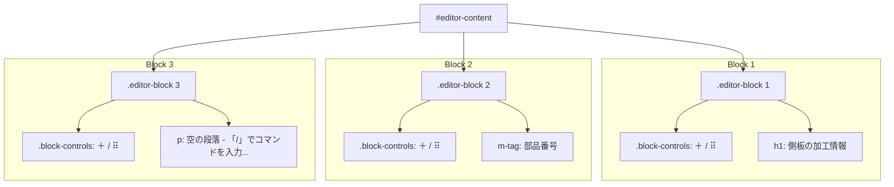

# 実装計画：Notion風ブロックエディタへの進化

既存の簡易編集エディタを、Notionのようにブロック単位で操作（ドラッグ＆ドロップによる並び替え、ブロックメニュー、スラッシュコマンド `/` によるブロック挿入）ができる、プレミアムでインタラクティブなブロックエディタへと進化させます。

---

## 1. ユーザーレビューが必要な項目

> [!IMPORTANT]
> **Notion風ブロックエディタの操作仕様**
> *   **ブロックラッパーの導入**: すべての段落（P）、見出し（H1）、カスタムコンポーネント（発注書、部材、手配リスト等）をブロックとして包みます。
> *   **ホバーコントロール**: ブロックの左側にホバー時にのみ `＋`（新規ブロック追加）と `⠿`（ドラッグハンドル・ブロックメニュー）が表示されるようにします。
> *   **ドラッグ＆ドロップ**: `⠿` ハンドルをドラッグすることで、ブロックを直感的に上下並び替えできるようにします。
> *   **スラッシュコマンド (`/`)**: 空のテキストブロックで `/` を入力すると、挿入可能なブロック一覧（見出し、段落、発注書、部材、手配リスト）のフローティングメニューが表示され、矢印キーとEnterで選択・挿入できるようにします。

---

## 2. 変更予定の詳細

### ① フロントエンド・エディタ画面の改修

#### [MODIFY] [test.html](file:///C:/Users/kouic/source/repos/w-cms/assets/test.html)
エディタ領域のマークアップとスタイル、およびイベント処理ロジックを大幅にアップグレードします。

*   **スタイル (CSS) の追加**:
    *   ブロックラッパー（`.editor-block`）とホバーコントロール（`.block-controls`）の配置とアニメーション。
    *   ドラッグ中の視覚効果（`.dragging`, `.drag-over` 等による青い境界線の明示）。
    *   スラッシュコマンドメニュー（`.slash-menu`）のスタイリッシュなポップアップ（グラスモルフィズム調、シャドウ、ホバーエフェクト）。
    *   ブロックメニュー（`.block-menu`）のポップアップデザイン。
    *   空ブロックのプレースホルダー（`「/」でコマンドを入力...`）の表示制御。
*   **イベントハンドリングの追加**:
    *   **Drag & Drop**: HTML5 Drag and Drop API によるブロック単位のドラッグソート。
    *   **Keyboard navigation**:
        *   `Enter` キーで新しいテキストブロックを下に作成。
        *   `Backspace` キーでブロックが空の場合に削除し、直前のブロックにフォーカスを戻す。
        *   `ArrowUp` / `ArrowDown` キーでブロック間のカーソル上下移動。
        *   `/` キー入力時のメニュー表示と、矢印キー・Enterによる選択処理。
    *   **Focus / Blur**: 現在アクティブなブロックのハイライトと、プレースホルダー表示。
*   **シリアライズ処理の修正 (`updateHtmlPreview`)**:
    *   ブロックラッパーから内包されている要素（`h1`, `p`, `m-tag`, `m-file` 等）を正確に抽出してシリアライズするように書き換えます。

---

### ② Web Components の親和性調整

#### [MODIFY] [web-components.js](file:///C:/Users/kouic/source/repos/w-cms/assets/web-components.js)
*   カスタムタグ内のインプット要素等で `Enter` や `Backspace` キーを押した際に、親のブロックエディタ側に不要なキーボードイベント（新規ブロック作成など）が伝播して誤作動しないよう、`event.stopPropagation()` を適切に噛み合わせます。

---

## 3. 実装のモックアップ構成 (UI)

---

## 4. 検証計画

### 自動テスト
*   既存 of `go test ./...` を実行し、エディタ改修後もシリアライズ結果のHTMLがGoサーバーで正しくパースされ、DBに不整合なく保存されることを検証します。

### 手動テスト
*   ブラウザで `test.html` を開き、以下の操作ができることを検証します。
    1.  ブロックをホバーしたときに左側にコントローラーが表示されること。
    2.  ドラッグハンドル `⠿` を掴んでブロックの順番を入れ替えられること。
    3.  `/` を押してメニューを出し、そこから部材定義や発注書、見出しを挿入できること。
    4.  キーボードの `Enter` / `Backspace` / 矢印キーでNotionと変わらないスムーズな操作感でブロック間を移動・作成・削除できること。
