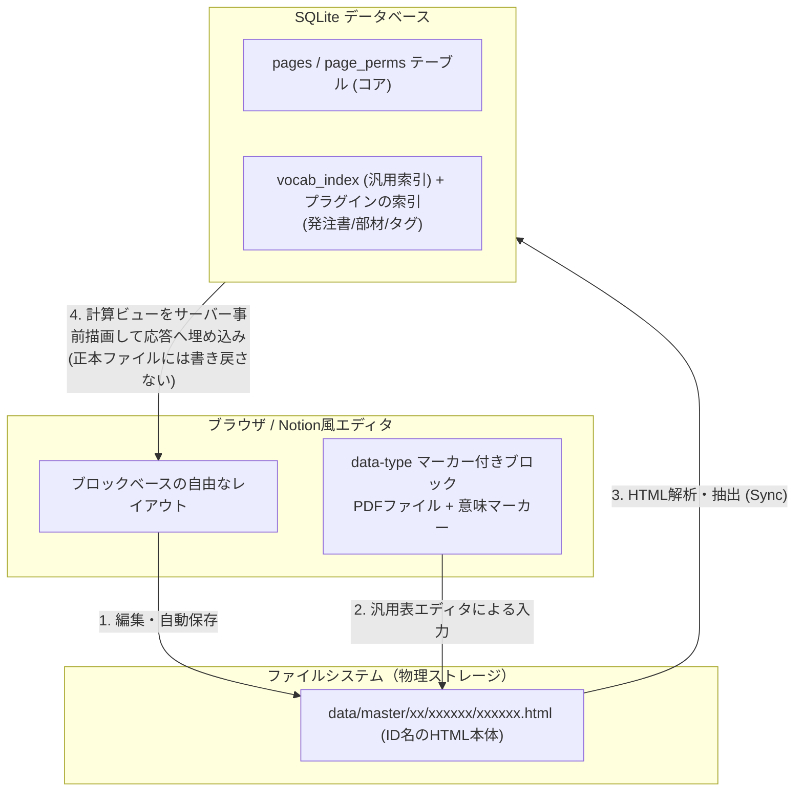

# コンセプト

このドキュメントでは、**w-cms** の基本コンセプトである「自由なファイルベース保存と、タグ（名前：値）による意味付けをベースとした双方向データ連携」の仕様について定義します。

---

## 0. ひとことで言うと：**ワンノートに検索と集計を付けたもの**

> 「そもそもがワンノートに検索や集計機能を付けたようなものです」——2026-08-21・ユーザー

**この一文が w-cms の位置づけの正本です。** 設計に迷ったら、まずここへ戻ってください。

作り手は現在ワンノートで業務を回しており、その**運用そのものは変えたくない**——
自由に書ける、階層に並べる、図面や発注書PDFを貼る、といった使い勝手はそのままです。
足りないのは2つだけです。

1. **検索**——ワンノートは**ハイフンで区切られた図面名称をうまく検索できません**。
   これは w-cms を作る動機の1つとして名指しされたものです（2026-08-21）。
   図面番号・図面名称など、現場が既に付けている様々なタグを引けるようにしたい。
2. **集計**——複数のページに散った受注・部材・発注を突き合わせて数を出したい。

**ここから、本書と各設計書の主要な決定がほぼすべて導けます。**

| ワンノートに無い制約は持ち込まない | 帰結 |
|---|---|
| ワンノートに「入力フォーム」は無い | 硬直的な帳票システムにしない（下の §1） |
| ワンノートのページは自由に書ける | サニタイズは安全のためだけ。**未知の形式も保存を通す**（拒否せず告知） |
| ワンノートのページ名は自由に変えられる | **`data-type` の改名を許す**。壊れるのは索引側（[【考察】語彙モデル.md](【考察】語彙モデル.md) §9） |
| ワンノートに機械的なIDは見えない | **「見える文字がすべて」**——項目の鍵は見出しの表示文字ただ1つ |
| ワンノートのページは名前で識別する | **表示されている言葉が機能を表す**。ページ名で挙動が変わるのは意図どおり（[【考察】ページテンプレート.md](【考察】ページテンプレート.md) §9・テンプレート置き場） |
| ワンノートのノートはファイルである | **文書が主、データベースが副**。DBはファイルから作り直せる派生索引 |

**「文書が主、データベースが副です」**（2026-08-21・ユーザー）——検索と集計は
**後から足した機能**であって、文書のあり方を縛る理由にはならない、という優先順位です。
索引が壊れても文書は無傷で、索引は作り直せます。

---

## 1. コア・コンセプト：自由な記述と「タグ」によるデータの意味付け

w-cms は、入力項目が固定された硬直的な入力フォーム（帳票システム）を排除します。**「Notionのように、テキストや見出しを自由なブロックレイアウトでフラットなページに記述し、PDF等の原本ファイルを好きな場所に配置し、タグを付与することでその情報の意味（親ページ、発注書、部材など）をデータベースに自律的に認識させる」**というデータ連携を採用しています。



### ① すべてがフラットな「ただのメモ（ページ）」
システム上には「顧客管理画面」「製品管理画面」といった特有のページ種別は存在しません。すべてのページはフラットな数字IDのフォルダに格納された、同一の構造を持つHTMLファイルです。
*   **自動採番**: ページID（ファイル名）は、新規作成時に連番の10進数で付与されます（**ゼロ詰め6桁**。例: `000001`）。
*   **物理分離**: ファイルはディレクトリ階層に分散して格納されます（IDの先頭2文字を親フォルダにする。例: `data/master/00/000001/000001.html`）。

### ② ページの役割は「どこに置いたか」と「何という名前か」でだいたい決まる
そのページが何のページなのかは、**階層——とりわけ親が何のページか——と、ページのタイトル**でだいたい決まります。ワンノートで「顧客名のセクションの下に機種名のページを作る」だけで用が足りているのと同じで、**役割を宣言する特別な操作は要りません**（§0「ワンノートに無い制約は持ち込まない」）。

*   「A社」の下にある「機種X」は、それだけで**A社の機種のページ**です。
*   ページ名が「テンプレート」であるページの子孫は、テンプレートとして扱われます——**表示されている言葉が機能を表す**の実例（[【考察】ページテンプレート.md](【考察】ページテンプレート.md) §9）。

はっきり示したいときは、**「名前：値」のタグで書けます**（`<dl data-type="tags">` に「種別：発注書」など）。タグ名は自由なので、現場が既に使っている呼び方をそのまま書けます。**タグは検索の鍵でもある**ので、書けばそのまま引けるようになります（§0 の「検索」）。

そのうえで、**集計に載せたいブロックにだけ**意味マーカーを付けます。
*   `<section data-type="client-order">` を配置すると、そのページの受注が集計に載ります。

つまり順序は、**人が読む階層と名前が主、`data-type` は機械が数えるための副**です。役割を持たせるためにマーカーを置くのではなく、**数えたいから置く**のだと考えてください。

### ③ 仮想的な親子関係（階層）の表現
「顧客 ＞ 完成品機種 ＞ 部品」のような階層構造も、データベースの固定設計ではなく、各ページが持つ**親ページID**によって表現します。複雑なディレクトリ構造を気にせず、親を1つ指すだけで仮想的なツリーを表現できます。
（当初は本文中の「親ページを示すタグ」で表現していたが、ページ属性は本文と分離した**サイドカー** `<id>.meta.json` が正本になった——本文を編集できる人が自分の権限や所属を書き換えられないようにするため。[認証認可設計.md](認証認可設計.md) §1）

### ④ データベースによる一元集計とサーバー事前描画
データベースにはすべてのドキュメントから抽出されたデータがフラットに集約されます。
本文に `<section data-type="required-materials">` のような**計算ビューのマーカー**を配置すると、サーバーがページを返すたびに中身（必要な部材の総数と手配状況など）を埋めて返すため、**閲覧側はJavaScriptを一切使わずに結果を読めます**（公開ページのSEO要件と整合。2026-08-19 決定）。仕組みは [アーキテクチャとDBスキーマ.md](アーキテクチャとDBスキーマ.md) 4.4。

---

## 2. 標準HTML＋`data-*` マーカーによるブロック構造

HTML内には**標準のHTML要素に意味マーカー（`data-type`）を付けたもの**がシリアライズされて保存されます。これがバックエンドのパーサーと連携し、DBへのインデックス化を実現します。

### マークアップ例（原則が出そろう最小の1枚）
```html
<section data-type="client-order">
  <dl>
    <dt>発注書番号</dt><dd>PO-2026-001</dd>
    <dt>発注元</dt><dd>テスト株式会社</dd>
  </dl>
  <table data-type="client-order-items">
    <tbody>
      <tr><th>品番</th><th>品名</th><th>単価</th><th>数量</th></tr>
      <tr><td>ITEM-A</td><td>特殊シャフト</td><td>5000</td><td>10</td></tr>
    </tbody>
  </table>
</section>
```
業務文書ブロック（`data-type="client-order"` ＝発注書）が**ヘッダの `<dl>`** と**明細の `<table>`** を包み、**項目の鍵は見出しの表示文字**（`dt`／`th`）、**値は属性ではなく要素の中身**にあります。だから閲覧側はJavaScriptなしでそのまま読め、Goのパーサーはこれを読み取ってリレーショナルデータベースに登録できます。

- 形式ごとの外形（ファイル容器 `<section data-type="file">`・可変タグ・計算ビューなど）の一覧は [【一覧】語彙.md](【一覧】語彙.md) §2（定義の実体は [vocab.go](../internal/cms/vocab.go)）。
- **新しい文書種別は語彙レジストリへ宣言を1件足すだけ**で増やせます（集計が要るときだけプラグインを書く）。なぜこの形なのかは [【考察】語彙モデル.md](【考察】語彙モデル.md)。

（※データベースの詳細なスキーマについては [アーキテクチャとDBスキーマ.md](アーキテクチャとDBスキーマ.md) を、エディタのUI技術仕様については [エディタ仕様.md](エディタ仕様.md) を参照してください。）

---

## 3. UI実装方式：バニラJS＋標準HTML（フレームワーク・ライブラリ不採用）

UI実装は**バニラJS＋標準HTML**で行う。この判断の柱は3つで、恒久的な設計記録として残す。

*   **保存形式とDOMの一致**（決定打）: 編集中のDOM自体がそのまま保存対象のHTMLになるため、React等の仮想DOM系フレームワークのような「HTML文字列への変換層」が不要。
*   **バックエンド連携の単純さ**: Goバックエンド（`internal/cms/parser.go` ほか）は標準の `golang.org/x/net/html` パーサーでタグ名・属性をそのまま再帰トラバースするだけでデータ抽出が完結する。
*   **contenteditableとの共存**: リッチな`contenteditable`領域と同一DOM上で自然に共存させられる。Reactなどを併用する場合、contenteditableとの統合は業界的にも難所であり（多くのリッチエディタはProseMirror等の専用ライブラリに依存する）、フレームワーク導入はオーバーエンジニアリングと判断。

この3本柱は**素のDOMの性質**であり、React/Vue はこれを壊すため選択肢に入らない（ビルド工程ゼロの方針とも衝突する）。追加のフロントエンドライブラリも不要である。

**Web Components（カスタム要素 `<m-*>`）は廃止を決定し（2026-08-17）、移行を完了した（2026-08-20）。** 当初はこの3本柱の実現手段としてカスタム要素を採用したが、**3本柱はカスタム要素固有のものではなく素のDOMの性質**だったため、語彙は標準HTML＋`data-*` マーカーへ完全統一した（廃止の決定と理由は [【考察】語彙モデル.md](【考察】語彙モデル.md) §9 の決定ログが正本）。動的な振る舞いは、編集モードのクローム（エディタ）と閲覧ビューのエンハンサ（マーカー要素に配線するバニラJS）／サーバー事前描画が担う。

**現在のカスタム要素は0種**。副産物としてテンプレート機構由来のXSS経路（下記「既知の課題」）とインライン `style=` が発生源ごと消え、**CSP の strict 化（`'unsafe-inline'` なし）も完了**した（[本文サニタイズ設計.md §6](本文サニタイズ設計.md)）。**新しいカスタム要素は作らない**——新しい語彙は語彙レジストリ（[vocab.go](../internal/cms/vocab.go)）へ `data-type` の宣言を1件足す。

---

## 既知の課題（すべて解消済み・記録として残す）

2026-06-20時点でのWeb Components実装に残っていたプロトタイプ的な粗さ——**高い結合度**
（`window.updateHtmlPreview` 等のグローバル関数依存）・**Shadow DOM方針の不統一**（実害あり。
`<m-tag>` の値編集などが `TypeError` で動いていなかった）・**非効率な再描画**・**テンプレート展開の
XSS**——は、個別に直すのではなく **2026-08-20 の移行（機構ごとの撤去）で一括して解消した**。
基底クラス `MElement` もテンプレート展開エンジンも、もう存在しない。各項の詳細な記録は
[変更履歴アーカイブ.md](変更履歴アーカイブ.md)（2026-08-04・2026-08-05）と
[変更履歴.md](変更履歴.md)（2026-08-20 の移行）にある。

**教訓としてここに残す1件（XSS・2026-08-04）**: テンプレート変数の展開
（`/assets/templates/*.html` を `fetch` し `String.replace` で変数展開する自作エンジン）に
エスケープが無く、**実際に発火する保存型XSS**だった（`<m-tag value='" onmouseover="…'>` で
属性を注入でき、`value` に `` を入れればスクリプトが走った）。要点は
**サーバーのサニタイザでは止まらなかった**こと——`value` はURL属性ではないので中身を検査せず、
`&lt;img…&gt;` として保存された値を `getAttribute()` が生の文字列へ戻すため。中間版CSPの
`script-src 'unsafe-inline'` もインラインイベントハンドラを許すので防げなかった。
**サニタイズとCSPの二層があっても、描画側のエスケープは別途必要**である。

**いまも有効な規則**: 値を文字列連結＋`innerHTML` で差し込む書き方を新たに持ち込まないこと。
フロントのDOM生成は `createElement` ＋ `textContent`（ブラウザが自動エスケープする）で行い、
サーバー側の描画（[view_render.go](../internal/cms/view_render.go)）も `html.EscapeString` を通す。
